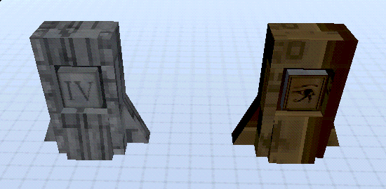
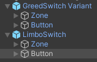
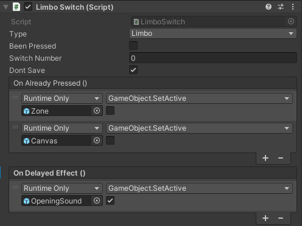

# Buttons

Buttons are a single-use trigger that can be used to activate events, open doors, etc.

## Prefabs
There are two prefab buttons available:
- `LimboSwitch`
- `GreedSwitch Variant`

They are both very similar, just with different textures. They can be found in `ULTRAKILL Assets/Prefabs/Levels/Interactive`.

## Usage

The main component of the buttons are the `LimboSwitch` script, attached to the `Button` child.

- `On Delayed Effect` - Events in this list will be invoked 1 second after the button is pressed. This is where you should put the events that you want to be triggered by the button, such as activating objects, opening doors, etc.
- `On Already Pressed` - Events in this list will be invoked when the button is pressed again, after it has previously been pressed.

:::warning
`Dont Save` should be set to `True`, and/or `Type` set to `None`, in order to not interfere with the base game.
:::

- `Type` - The save type of the button. This should probably be set to `None`.
- `Switch Number` - The save number of the button. For example, the switches in Limbo have the numbers 1-4, so that they can be checked in 1-4.
