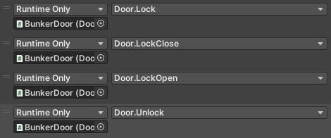
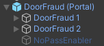
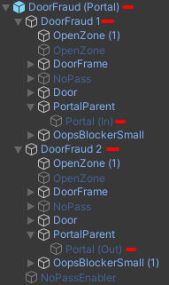
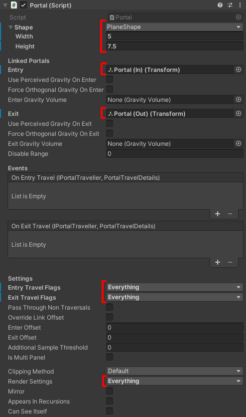

## General Information

- `Door Type`
  - `Normal` - A door that moves to open/close.
  - `Big Door Controller` - A door with multiple parts that rotate.
  - `Sub Door Controller` - A door with multiple parts that move.
- `Activated Rooms` - *Activated* when the door starts to open.
- `Deactivated Rooms` - *Deactivated* when the door starts to open.
- `Start Open` - Whether the door should start the scene open.
- `Door Handles` - A list of Animators. The door sets the 'Open' bool paramater of all the animators when the door opens or closes.

### Normal Doors

No other components are needed.
- `Open Pos` - The relative position to move to when opened.
- `Speed` - The opening/closing speed of the door.
- `Ease In` - Whether to ease the door's movement

### Big and Sub Door Controllers

The door component itself will not move the object it's attached to.
They will look for `Big Door` or `Sub Door` (based on whichever type it is), and those sub-objects will control how the door moves.

- `Player Speed Multiplier` - When enabled, the door's rotation speed scales with the player's movement speed.
  - This should likely be set to `True` for any generic door to allow it to open in time for players who move faster. This is set for most non-cutscene doors.

#### Big Door
The door will rotate around its pivot (see [Pivot vs. Center](./Pivot%20Vs.%20Center/index.mdx))
- `Open Rotation` - The offset rotation where the door should open to.
- `Speed` - The speed to rotate at, in °/s.
- `Gradual Speed Multiplier` - How quickly the door accelerates while it is moving, higher values make the door start at the base speed and ramp up faster over time.
- `Screen Shake` - Whether to apply screen shake when the door is moving.

#### Sub Door
- `Open Pos` - The relative position to move to when *opened*.
- `Origin Pos` - The relative position to move to when *closed*.
- `Speed` - The opening/closing speed of the door.
- `Dr` - The parent door component.

---

## Locking

### As part of an arena

Place the door(s) under the `Doors` list in your `Activate Arena` component.

See [Arenas](../Arenas%20And%20Enemies/index.mdx)

### Manually

As part of a Unity event, you can unlock doors, lock them, or force them to remain open or closed.

The `DoorUnlocker` component will unlock the `Door` param when it gets enabled.

### Via `DoorLock`s

The `DoorLock` prefab can be found in `ULTRAKILL Assets/Prefabs/Levels/Doors`.
To use it, place it as a child of the door you wish to be locked. This will then automatically lock the door as long as the `DoorLock` is active and 'closed'.
To unlock the door, you can either open it, or disable the `DoorLock` game object.

---

## Opening Doors
### Door Controller
The `Door Controller` component should be placed on a GameObject with a trigger collider, as a child of the door you wish to open.
When the player enters the trigger, the door will open.
When the player exits the trigger, the door will close.

### Door Opener
The `Door Opener` component can be used to open doors. It has two different behaviors:
- If attached to a GameObject with a trigger collider, it will open the door when the player enters the trigger.
- If not, it will open the door immediately when it is enabled.

---

## Linked Doors
The main way to link two doors together is to use a `Big Door Controller` or `Sub Door Controller`.

### Portal Doors
For a general portal tutorial, see [Portals (Redirect)](../../Advanced%20Tutorials/Portals/index.mdx)

The only prefab setup to use portals is the `DoorFraud (Portal)` (found in `ULTRAKILL Assets/Prefabs/Levels/Doors`). It does require a couple changes, because Rude doesn't seem to decompile Portals properly.
- There are three sub objects: `DoorFraud 1`, `DoorFraud 2`, and `NoPassEnabler`.
  {/* -  */}
  - 
  - `NoPassEnabler` - Can be activated to activate the `NoPass` (the red skull and collider) on both doors.
  - `DoorFraud 1` and `DoorFraud 2` - These can be positioned anywhere in the world.
- On the root object, find the Portal component.
  - Set the `Shape` to a `5` by `7.5` `PlaneShape`
  - Under `Linked Portals`, set `Entry` to `DoorFraud 1/PortalParent/Portal (In)`, and `Exit` to `DoorFraud 2/PortalParent/Portal (In)`
  - Set `Entry Traveller Flags` and `Exit Traveller Flags` as needed, to allow or disallow travelling through the portal.
  - Set `Render Settings` as needed, to set which sides render.

It should look similar to this:

